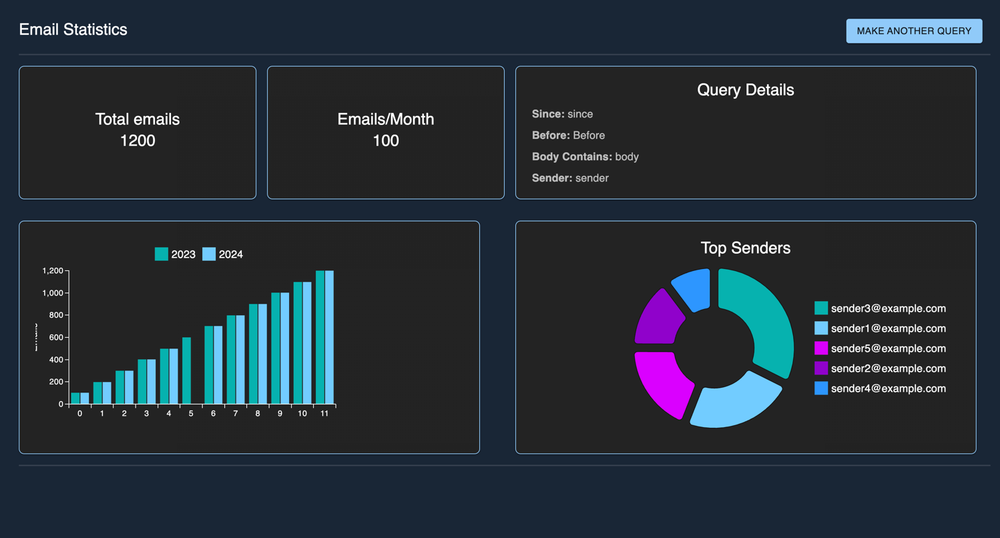

# ZenInbox



ZenInbox is a productivity tool designed to help you declutter your inbox and gain insightful statistics about your
email usage. With ZenInbox, you can:

- View detailed statistics about your inbox.
- Identify trends and patterns in your email activity.
- Mass delete unwanted emails with ease.

## Features

- **Email Statistics**: Analyze email usage patterns, sender trends, and other metrics.
- **Bulk Actions**: Quickly delete or archive emails in bulk based on filters or insights.
- **User-Friendly Interface**: A modern, responsive design built with React and TypeScript.

## Tech Stack

- **Backend**: FastAPI and Python.
- **Frontend**: React and TypeScript.

## Getting Started

### Installation

1. Clone the repository:
   ```bash
   git clone https://github.com/rubengardner/zen-inbox.git
   ```

2. Install frontend dependencies:
   ```bash
   cd clients/web
   npm install
   ```

### Running the App

1. Start the backend server:
   ```bash
   uvicorn vendors.fast_api.main:app --reload
   ```

2. Start the frontend development server:
   ```bash
   cd clients/web
   npm start
   ```

3. Open your browser and navigate to `http://localhost:3000` to use ZenInbox.

## Usage

1. Connect ZenInbox to your email account.
2. Browse through detailed inbox statistics.
3. Use the filtering and bulk actions to manage your emails efficiently.


